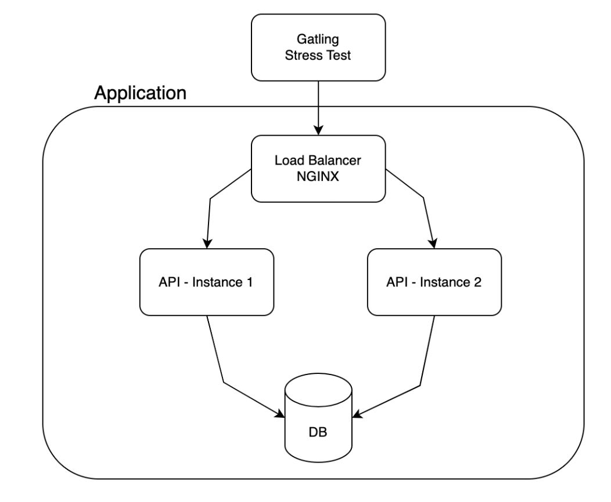

# API Under Stress
A simple REST API that is designed to effectively handle high loads, unexpected
spikes in traffic, and various types of stress scenarios, ensuring minimal service
disruption and consistent performance. 

# Tech Stack
This web application uses the following technologies:
- Flask
- MySQL
- Nginx

# Architecture

# Load Testing and Performance Measurement
Gatling will be used to stress test this API and measure its performance. The Gatling simulation scripts used to test this API are found [here](https://github.com/rwkliu/Warrior-API-Gatling).
